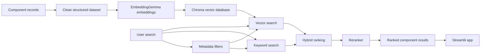

# Smart Component Search

A local engineering component search app that combines **semantic vector search, keyword search, metadata filters, hybrid retrieval, and reranking** to find the most relevant electronic components.

Built as **Module 5 — Build 5B: Smart Component Search** in my AI Engineering Builder Path.

## What It Does

Users can search for components using natural language such as:

> cheap 5V temperature sensor

The system can also apply exact filters for:

- component category
- maximum price
- required voltage

Results are ranked and displayed in a Streamlit app with the component ID, description, category, voltage range, material, size, price, keywords, and final reranking score.

## Features

- Semantic search with local embeddings
- Persistent Chroma vector database
- Keyword-based retrieval
- Metadata filters
- Hybrid vector + keyword retrieval
- Reciprocal Rank Fusion for hybrid ranking
- Final rule-based reranking
- Add and update component records
- Duplicate-name protection
- Repeatable vector-database updates
- 20-query retrieval benchmark
- Streamlit graphical interface
- Windows launcher for easy local use

## Architecture



## Dataset

The repository currently contains **121 component records**.

The initial dataset was generated as a **synthetic educational dataset** with 120 records across these categories:

- resistors
- capacitors
- LEDs
- sensors
- microcontrollers
- transistors
- relays
- motors
- switches
- connectors

An additional test sensor record was added through the component-management workflow to verify ingestion, updates, and duplicate handling.

Each record includes fields such as:

- stable component ID
- name
- category
- description
- minimum and maximum voltage
- material
- size
- estimated cost
- keywords
- source type
- source reference
- usage/permission note

Because the dataset is synthetic, benchmark results should **not** be interpreted as performance on a large real-world electronics catalog.

## Retrieval Pipeline

### 1. Vector search

Component text is embedded locally using **EmbeddingGemma through Ollama** and stored in Chroma. A user query is embedded with the same model and compared against the indexed component vectors.

### 2. Keyword search

The system tokenizes the query and component text, scores direct term matches, and gives extra weight to matches in component names.

### 3. Metadata filters

The search system supports exact constraints including:

- category
- maximum cost
- required voltage within the component's supported voltage range

### 4. Hybrid search

Vector and keyword rankings are merged using **Reciprocal Rank Fusion (RRF)**.

### 5. Reranking

The hybrid candidates are reranked using query-specific signals including:

- component-name matches
- category matches
- description matches
- voltage compatibility
- price constraints
- lower cost when the query contains terms such as "cheap" or "budget"

## Benchmark

The system was evaluated using **20 search queries with expected relevant component IDs**.

| Retrieval Method | Top-1 | Top-3 |
| --- | ---: | ---: |
| Vector | 20/20 — 100% | 20/20 — 100% |
| Keyword | 20/20 — 100% | 20/20 — 100% |
| Hybrid | 20/20 — 100% | 20/20 — 100% |
| Reranked | 20/20 — 100% | 20/20 — 100% |

Full raw benchmark results are stored in:

`evaluation/benchmark_results.json`

### Interpretation

All four methods reached 100% on the current benchmark. This does **not** show that the methods are equally strong on real-world retrieval. The current dataset is small, synthetic, highly structured, and the benchmark queries closely match the available component categories and names.

A stronger future evaluation should use a larger real-world catalog, more ambiguous queries, near-duplicate components, noisy metadata, and harder constraint combinations.

## Project Structure

```text
smart-component-search/
├── app.py
├── requirements.txt
├── run_app.bat
├── data/
│   └── components.json
├── evaluation/
│   ├── benchmark.py
│   └── benchmark_results.json
├── scripts/
│   └── generate_dataset.py
└── src/
    ├── build_index.py
    ├── hybrid_search.py
    ├── manage_components.py
    ├── reranker.py
    └── search.py
```

The local `chroma_db/` directory is intentionally excluded from GitHub because the vector database can be rebuilt from the dataset.

## Requirements

- Python 3
- Ollama
- EmbeddingGemma
- ChromaDB
- Requests
- Streamlit

Install the Python dependencies:

```powershell
pip install -r requirements.txt
```

Install the local embedding model:

```powershell
ollama pull embeddinggemma
```

## Setup

Clone the repository and enter the project folder:

```powershell
git clone https://github.com/OMARIMI/smart-component-search.git
cd smart-component-search
```

Install dependencies:

```powershell
pip install -r requirements.txt
```

Make sure Ollama is running and the embedding model is available:

```powershell
ollama pull embeddinggemma
```

Build the local Chroma index:

```powershell
python .\src\build_index.py
```

The indexer should finish by reporting the number of component records stored in Chroma.

## Run the App

Start the Streamlit interface:

```powershell
python -m streamlit run app.py
```

On Windows, the included launcher can also be used:

```text
run_app.bat
```

The launcher starts the Streamlit app from the local project folder.

## Manage Components

To add, update, or inspect component records:

```powershell
python .\src\manage_components.py
```

The manager supports:

1. adding a component
2. updating an existing component
3. checking JSON/Chroma record counts
4. blocking duplicate component names

When a record is added or changed, the JSON dataset and Chroma index are updated together.

## Run the Benchmark

```powershell
python -m evaluation.benchmark
```

The benchmark runs 20 queries across:

- vector search
- keyword search
- hybrid search
- reranked search

It then calculates Top-1 and Top-3 retrieval success and saves the complete report to `evaluation/benchmark_results.json`.

## Example Search

Query:

```text
cheap 5V temperature sensor
```

Example filters:

```text
Category: sensor
Maximum price: $3
Required voltage: 5 V
```

The system retrieves compatible sensors and reranks the best matches, with lower-cost relevant temperature sensors prioritized.

## Limitations

- The dataset is synthetic and small compared with real engineering catalogs.
- Prices are educational estimates, not current market prices.
- The benchmark is relatively easy because the records are structured consistently.
- There is no live supplier inventory or availability data.
- Embedding generation currently depends on a local Ollama server.
- The Streamlit app is currently designed for local use rather than public deployment.
- The reranker uses deterministic scoring rules rather than a learned cross-encoder reranker.

## Possible Next Improvements

- Replace or supplement the synthetic records with licensed real component catalogs.
- Add manufacturer, part number, package type, current rating, tolerance, and availability metadata.
- Create a harder retrieval benchmark.
- Test a learned reranking model.
- Add result explanations showing why each component matched.
- Package the app as a standalone desktop executable.
- Deploy a hosted demo.

## What I Learned

This project helped me practice:

- embeddings and vector databases
- semantic similarity search
- structured metadata filtering
- keyword retrieval
- hybrid search
- Reciprocal Rank Fusion
- reranking
- ingestion and update pipelines
- duplicate handling
- retrieval evaluation
- Top-1 and Top-3 accuracy
- building a usable UI on top of an AI retrieval backend

## AI Assistance Disclosure

AI tools were used for coding guidance, debugging, project planning, and documentation support. The project was built, run, tested, and evaluated through the local development workflow, with benchmark results saved in the repository.
